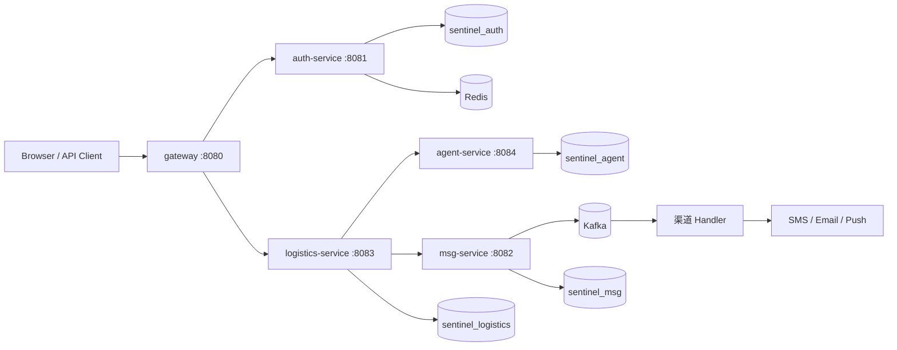

<div align="center">

# Sentinel

**物流异常主动感知与 AI 自动闭环处置平台**

基于 Spring Boot / Spring Cloud Gateway / Kafka / Redis / MySQL 的 Java 微服务项目

[](https://openjdk.org/)
[](https://spring.io/projects/spring-boot)
[](https://spring.io/projects/spring-cloud)
[](https://kafka.apache.org/)
[](https://redis.io/)
[](https://www.mysql.com/)
[](https://github.com/aroura-dev/Sentinel/actions/workflows/ci.yml)
[](LICENSE)

</div>

<p align="center">
  <a href="#快速开始">快速开始</a> ·
  <a href="#系统架构">系统架构</a> ·
  <a href="#技术思考日志">技术思考日志</a> ·
  <a href="#测试文档">测试文档</a> ·
  <a href="#工程验证">工程验证</a> ·
  <a href="#目录结构">目录结构</a>
</p>

## 项目定位

Sentinel 面向电商物流订单异常处置场景，把“异常发现、工单建单、多渠道通知、客服答疑、人工兜底”串成可审计的自动闭环。

系统按鉴权、物流、消息和 Agent 四个域拆分独立服务，每个服务拥有独立 MySQL 库；Gateway 统一入口，服务间通过 REST 与 Kafka 解耦，AI 文案与消息触达均为跨服务调用。

## 核心能力

- **Agent 编排闭环**：LangChain4j + 通义千问编排多个专职 Agent，完成异常诊断、工单生成、客服答疑和文案生成。
- **Agent 审批与审计**：异常诊断、通知文案、工单处置由 Spring Boot 编排；只读步骤自动执行，写操作进入待审批，上下文落 `agent_call_log`。
- **服务拆分**：Auth、Logistics、Msg、Agent 独立部署并各自分库，Gateway 统一路由。
- **消息可靠性**：Outbox + Kafka + 幂等消费，解决跨服务最终一致性和重复消息问题。
- **并发与背压**：按业务、撤回和轨迹拆分 Kafka 消费者组，独立线程池与 128 队列形成背压。
- **去重一致性**：ZSet + Lua 滑动窗口去重，首次放行、窗口内重复拦截，MySQL 唯一键兜底。
- **链路追踪**：`traceId` 贯穿订单、工单、通知和 Agent 调用，支持审计与回放。
- **故障降级**：模型超时、异常或停机时回退默认模板或转人工，通知闭环不中断。

## 快速开始

### 环境要求

只需要：

- Docker Desktop 或 Docker Engine，支持 Docker Compose v2
- 可选：Git，用于克隆仓库

不需要预装 JDK、Maven 或 Node.js，后端和前端会在容器内自动构建。

### 克隆并启动

可以把仓库克隆到任意目录：

```bash
git clone https://github.com/aroura-dev/Sentinel.git
cd Sentinel
```

可选：复制环境变量模板。默认配置已经可以直接启动：

```bash
cp .env.example .env
```

Windows PowerShell 可使用：

```powershell
Copy-Item .env.example .env
```

一条命令启动完整项目：

```bash
docker compose -f docker-compose.sentinel.yml up -d --build
```

首次启动会自动完成：

1. 在容器内编译 Sentinel 后端。
2. 构建 Vue 前端镜像。
3. 初始化 MySQL 表结构、当前用户、订单、库存、工单、账单、API 密钥和客服会话数据。
4. 启动 MySQL、Redis、后端和前端。

### 访问地址

| 服务 | 地址 |
|---|---|
| 管理端 | http://localhost:5173 |
| 后端 API | http://localhost:8080 |
| MySQL | localhost:3307 |
| Redis | localhost:6379 |

默认账号：`张伟 / Admin@123`。

### 停止与重启

停止但保留数据：

```bash
docker compose -f docker-compose.sentinel.yml down
```

重新启动：

```bash
docker compose -f docker-compose.sentinel.yml up -d
```

清空数据并重新初始化：

```bash
docker compose -f docker-compose.sentinel.yml down -v
docker compose -f docker-compose.sentinel.yml up -d --build
```

### 端口冲突

如果 `8080`、`5173`、`3307` 或 `6379` 已被占用，可在 `.env` 中修改：

```env
SENTINEL_BACKEND_HOST_PORT=18080
SENTINEL_FRONTEND_HOST_PORT=15173
SENTINEL_MYSQL_HOST_PORT=13307
SENTINEL_REDIS_HOST_PORT=16379
```

修改后重新执行启动命令即可。
## 系统架构



关键边界：

- `gateway` 只负责统一入口、身份头注入和路由，不承载业务规则。
- `auth-service` 负责用户、角色、登录会话，会话使用 Redis。
- `logistics-service` 负责订单、轨迹、状态机、工单和通知状态。
- `agent-service` 负责 AI 诊断、文案和调用日志，写操作保留审批。
- `msg-service` 只负责消息发送语义、渠道账号和发送记录。
- 服务间不跨库直接 `JOIN`，通过业务 ID、`traceId` 和事件关联。
- Kafka 负责异步削峰和消费者组隔离。

## 技术思考日志

该文档记录关键技术问题、备选方案、决策依据和验证结果。完整内容见 [`docs/ENGINEERING_JOURNAL.md`](docs/ENGINEERING_JOURNAL.md)。

| # | 技术问题 | 核心思考 | 最终选择 |
|---|---|---|---|
| 01 | 物流异常如何形成闭环 | 通知触达不等同于异常处置闭环 | 状态机、工单、通知、Agent、人工兜底串联 |
| 02 | 并发状态更新 | 合法性和并发冲突是两个问题 | 状态机管合法性，乐观锁管并发 |
| 03 | 数据库成功但事件丢失 | 双写没有天然原子性 | 业务表 + Outbox 同事务落库 |
| 04 | 固定窗口误判 | 窗口边界和并发会破坏计数 | Redis ZSet + Lua + MySQL 唯一键兜底 |
| 05 | 慢渠道导致消费阻塞 | 共享线程池可能造成业务相互影响 | topic/consumer group/动态线程池隔离 + 背压 |
| 06 | 模型不可用 | AI 不能成为通知链路的单点 | 只读自动执行，写操作审批，失败模板降级 |
| 07 | 如何拆分微服务 | 过细拆分增加一致性和运维成本 | 按鉴权、物流、消息、Agent 四域拆分 |
| 08 | 问题无法回放 | 只有最终状态无法解释处理过程 | traceId 贯穿订单、工单、通知和 Agent 调用 |
| 09 | Outbox 高频扫描 | 过滤和排序必须匹配索引顺序 | `status + next_retry_at + id` 覆盖索引 |
| 10 | 本地复现成本 | 需要明确的依赖、启动顺序和验收入口 | Docker Compose + CI smoke |

> **技术判断主线**：状态是否合法 → 并发是否覆盖 → 事务是否丢事件 → 消费是否重复 → 慢链路是否阻塞 → 模型失败是否降级 → 全链路是否可追踪。

## 测试文档

完整测试策略、覆盖范围和命令见 [`docs/TESTING.md`](docs/TESTING.md)。

| 层次 | 命令 | 当前基线 |
|---|---|---|
| 后端单元测试 | `mvn -B -ntp -pl sentinel-service-api-impl,sentinel-logistics,sentinel-agent -am test` | 19/19 |
| 前端单元测试 | `cd microservices/frontend-vue && npm test` | 4/4 |
| 服务打包 | `mvn -B -ntp -pl services/...,gateway -am package -DskipTests` | 四个服务 + Gateway |
| 端到端 Smoke | `bash infra/tools/smoke_closed_loop.sh` | Gateway → 三库闭环 |
| 故障降级 | 空模型 Key / Agent 停机 | 模板降级，通知不中断 |

测试关注点：

- **状态正确性**：状态机、节点迁移和并发冲突。
- **Agent 稳定性**：模型异常、超时和停机时确定性降级。
- **跨服务一致性**：登录、通知、Agent 日志和短信记录能够关联。
- **可重复性**：Smoke 使用动态订单和随机节点，最多重试 3 次。
## 工程验证

> 以下为本机 Docker 本地压测/基准数据，不是生产数据。

| 指标 | 结果 | 说明 |
|---|---:|---|
| 压测负载 | 200 并发、900 请求 | 经 Gateway 进入完整通知链路 |
| HTTP 请求受理 | 900/900 | 只代表请求成功进入系统 |
| 峰值 QPS | 74.35 | 本地单机环境 |
| P95 / P99 | 4.87s / 6.20s | 包含服务调用、数据库、Kafka 和短信桩 |
| 通知最终状态 | 1000/1000 SENT | 状态落库成功，不等于真实运营商送达 |
| Agent 实际模式 | 1000/1000 degraded | 本地未配置模型 Key，验证的是降级闭环 |
| SMS Stub | 1000/1000 | 未验证真实短信回执 |
| Kafka consumer lag | 0 | 压测结束后的最终 lag |
| Agent 停机故障注入 | 100/100 请求继续执行 | 默认文案降级，不是模型成功 |
| Outbox SQL 优化 | 199408 → 200 扫描行 | 20 万行隔离表，约 1.4ms |
| 核心后端测试 | 19/19 | 核心回归 |

详细结果见 [`microservices/docs/BENCHMARKS.md`](microservices/docs/BENCHMARKS.md) 和 [`docs/benchmarks/outbox-index.md`](docs/benchmarks/outbox-index.md)。

## 核心服务

| 服务 | 职责 |
|---|---|
| `gateway` | 统一入口、token 校验、身份头注入、路由 |
| `auth-service` | 注册、登录、登出、当前用户、Redis 会话 |
| `logistics-service` | 订单、轨迹、状态机、工单、通知闭环 |
| `agent-service` | 内容生成、异常诊断、客服路由、调用审计 |
| `msg-service` | 消息发送、Kafka 写入、渠道 Handler |
| `shared modules` | 领域模型、MQ 抽象、通用工具、共享 Web 层 |
| `infra` | 4 MySQL、Redis、Kafka、SMS Stub、smoke 脚本 |

## 本地验收

```bash
cd microservices
bash infra/tools/smoke_closed_loop.sh
```

手工验证：

```bash
TOKEN=$(curl -s -X POST http://localhost:8080/api/auth/login \
  -d "username=张伟&password=Admin@123" \
  | grep -oE '"token":"[a-f0-9]+"' | cut -d'"' -f4)

curl -s -X POST \
  "http://localhost:8080/api/logistics/notify/send?orderNo=<订单号>&node=IN_TRANSIT&role=buyer&channel=sms" \
  -H "Authorization: Bearer $TOKEN"
```

验收主线：

```text
logistics 触发通知
  → agent 生成文案并写 agent_call_log
  → notification_record PENDING
  → msg /send
  → Kafka
  → sms_record SENT
  → 回写 notification_record SENT
```

## 目录结构

```text
Sentinel/
├── microservices/
│   ├── common / support / handler / service-api     共享领域与基础设施模块
│   ├── sentinel-logistics / sentinel-agent          物流与 Agent 域
│   ├── services/{auth,msg,logistics,agent}-service  四个独立服务
│   ├── gateway                                      统一入口
│   ├── infra/docker/compose.infra.yml               完整容器编排
│   ├── infra/mysql/<svc>/init/*.sql                 各服务分库初始化
│   └── infra/tools/smoke_closed_loop.sh             端到端验收
└── docs/
    ├── ARCHITECTURE.md                              微服务架构说明
    ├── ENGINEERING_JOURNAL.md                       技术思考日志
    ├── DEPLOYMENT.md                                部署手册
    └── benchmarks/outbox-index.md                   索引基准
```

## 边界说明

- 本项目用于学习和求职作品展示，不代表生产级可用性。
- 压测、RAG 指标和故障注入均为本地环境口径。
- 当前未覆盖网络分区、多实例租约锁、真实短信回执和长时间稳定性。
- 模型、短信、支付和物流商能力通过可替换接口接入；默认演示使用桩服务或模板降级。