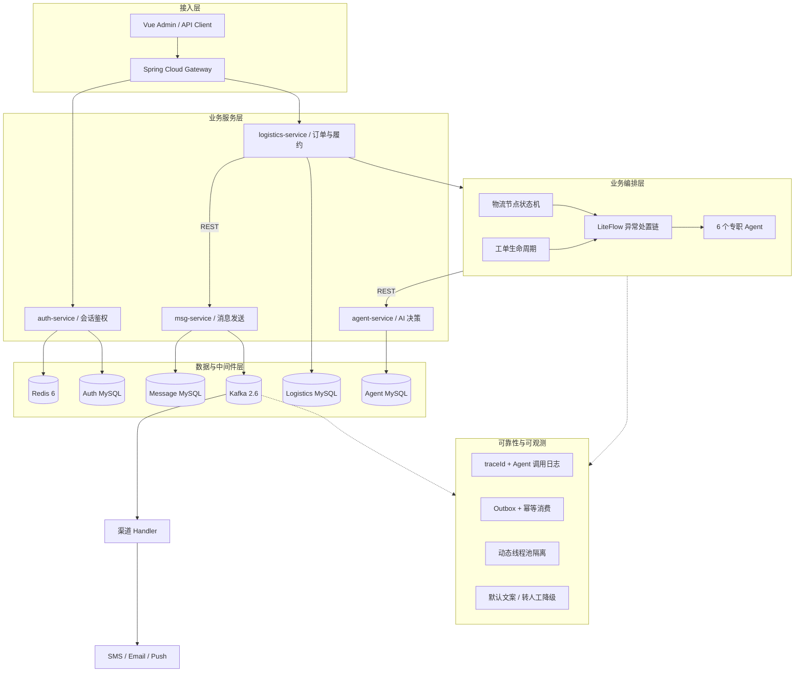

<div align="center">

# Sentinel

**物流异常主动感知与 AI 自动闭环处置平台**

基于 Spring Boot / Spring Cloud / Kafka / Redis / MySQL 的 Java 后端项目

[](https://openjdk.org/)
[](https://spring.io/projects/spring-boot)
[](https://spring.io/projects/spring-cloud)
[](https://kafka.apache.org/)
[](https://redis.io/)
[](https://www.mysql.com/)
[](https://github.com/aroura-dev/Sentinel/actions/workflows/ci.yml)

</div>

## 项目定位

Sentinel 面向电商物流订单异常处置场景，把“异常发现、工单建单、多渠道通知、客服答疑、人工兜底”串成可审计的自动闭环。项目包含模块化单体版和独立微服务版，覆盖 Java 后端开发、消息队列、缓存一致性、SQL 优化、状态机、故障降级、可观测性和 AI Agent 编排。

## 项目亮点

- **AI 自动闭环**：LangChain4j + 通义千问编排多个专职 Agent，完成异常诊断、工单生成、客服答疑和文案生成。
- **Java AgentOps**：异常诊断、通知文案、工单处置全部由 Spring Boot 编排；只读步骤自动执行，写操作进入待审批，上下文落 gent_call_log，服务重启后仍可恢复。
- **Java 智能助手**：基于知识库关键词召回、真实订单轨迹和固定只读指标实现问答与分析，不依赖外部脚本运行时。
- **微服务拆分**：鉴权、物流、消息、Agent 四域拆分独立服务并各自分库，Gateway 统一路由，REST / Kafka 异步解耦。
- **高并发治理**：Kafka 多 topic、多消费者组，按渠道和消息类型隔离动态线程池，128 队列配合 CallerRunsPolicy 形成背压。
- **Redis 一致性**：ZSet + Lua 滑动窗口去重，修复全量误判问题，首次放行、窗口内重复拦截。
- **SQL 优化**：Outbox 任务扫描使用 `status + next_retry_at + id` 覆盖索引，消除全表扫描和 filesort。
- **稳定交付**：状态机限制非法流转，通知状态覆盖 PENDING / SENT / FAILED，Agent 异常可确定性降级。
- **可观测**：traceId 贯穿跨服务调用，记录 token、工具、耗时、状态并支持回放定位。

## 实测数据

> 以下为本机 Docker 本地压测/基准数据，不是生产数据。

| 指标 | 结果 | 说明 |
|---|---:|---|
| 压测负载 | 200 并发、900 请求 | 经 Gateway 进入完整通知链路 |
| HTTP 请求受理 | 900/900 | 只代表请求成功进入系统 |
| 峰值 QPS | 74.35 | 本地单机环境 |
| P95 / P99 | 4.87s / 6.20s | 延迟包含服务调用、数据库、Kafka 和短信桩 |
| 通知最终状态 | 1000/1000 SENT | 状态落库成功，不等于真实运营商送达 |
| Agent 实际模式 | 1000/1000 degraded | 本地未配置模型 Key，验证的是降级闭环 |
| 短信桩结果 | 1000/1000 | SMS stub 返回成功，未验证真实短信回执 |
| Kafka consumer lag | 0 | 压测结束后的最终 lag |
| SQL 优化前 | 109–149ms | 20 万行隔离表，`ALL + filesort` |
| SQL 优化后 | 1.36–1.53ms | `range + Using index` |
| SQL 预估扫描行数 | 199408 → 200 | 基于 EXPLAIN，不等同于生产数据收益 |
| Agent 停机故障注入 | 100/100 请求继续执行 | 默认文案降级，不是模型成功 |
| 核心测试 | 20/20 | 模块化单体当前回归：18 个 Web 测试 + 2 个服务层测试 |

详细结果见 [Outbox SQL 基准](docs/benchmarks/outbox-index.md)。

> 当前测试未覆盖网络分区、多实例限流、真实短信回执、长时间稳定性和生产级容量，因此不能将上述结果表述为线上可用性或业务成功率。

## 系统架构

Sentinel 采用“接入层 → 业务服务层 → 业务编排层 → 数据与中间件层 → 基础设施层”的分层设计，同时提供模块化单体版和 `microservices/` 微服务版。



| 层 | 职责 | 主流技术 |
|---|---|---|
| 接入层 | 统一入口、路由、身份校验 | Spring Cloud Gateway、Vue、REST |
| 业务服务层 | 按鉴权、物流、消息、Agent 分域自治 | Spring Boot、Spring Cloud、MyBatis |
| 业务编排层 | 异常流程编排、状态迁移、Agent 工具调用 | LiteFlow、LangChain4j、状态机 |
| 数据与中间件层 | 异步削峰、缓存、持久化、消息路由 | Kafka、Redis、MySQL |
| 基础设施层 | 本地一键启动和端到端验证 | Docker Compose、JUnit 5、GitHub Actions |
| 横切能力 | 追踪、幂等、隔离、降级、审计 | traceId、Outbox、动态线程池、确定性降级 |

详细设计、关键数据流和部署拓扑见 [`docs/ARCHITECTURE.md`](docs/ARCHITECTURE.md)，业务接口、事务、测试与数据来源见 [`docs/EVIDENCE.md`](docs/EVIDENCE.md)。微服务版位于 [`microservices/`](microservices/)。

## 核心模块

| 模块 | 作用 |
|---|---|
| Web 与编排入口 | 鉴权、物流 TMS、工单、通知和 Agent 编排 |
| 消息处理引擎 | Kafka 消费、线程池隔离、限流、去重和渠道发送 |
| `sentinel-agent` | 异常诊断、工单、客服、文案和时效 Agent |
| `sentinel-logistics` | 订单、轨迹、状态机、通知和 Outbox |
| 基础组件 | Kafka、Redis、MyBatis 与通用工具 |
| `sentinel-frontend` | Vue 管理端 |
| `microservices/` | Sentinel 微服务版：Gateway、鉴权、物流、消息和 Agent 四个独立服务 |

## 验证与复现

```bash
git clone https://github.com/aroura-dev/Sentinel.git
cd Sentinel
docker compose up -d
```

核心验证入口：

```bash
docker compose ps
curl -X POST http://localhost:8080/api/auth/login   -d "username=admin&password=<由环境变量配置>"
```

数据库脚本位于 `doc/sql`，测试和 CI 配置位于 `.github/workflows`。

## 相关项目

- AI 模拟面试项目：[aroura-dev/ai-interview-coach](https://github.com/aroura-dev/ai-interview-coach)

## 说明

- 本项目用于学习和求职作品展示。
- 仓库中的数据库、Redis、消息队列和应用密码均通过环境变量注入，示例值仅用于本地 Docker 开发。
- 实测数据均标注为本地环境口径，不宣称线上生产指标。
