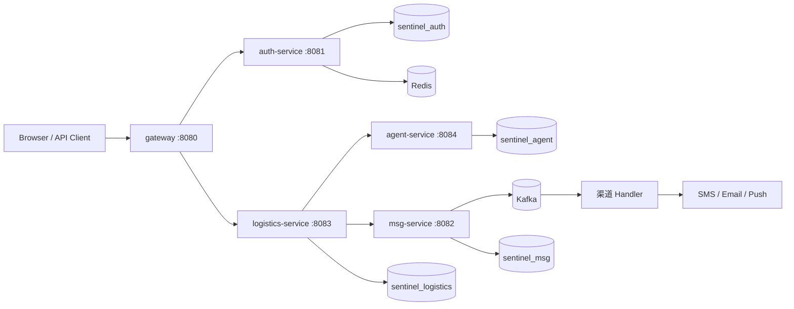
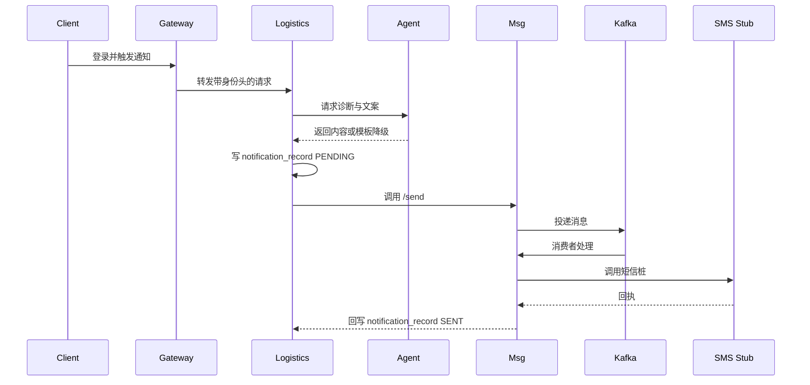

# Sentinel 技术架构

> 完整启动、端口、镜像与 smoke 验收见 [`../microservices/README.md`](../microservices/README.md)。

## 1. 架构目标

- 按鉴权、物流、消息、Agent 四域拆分服务，每个域独立部署、独立演进。
- 服务之间通过 REST 和 Kafka 解耦，不跨库直接 `JOIN`。
- 核心异常闭环必须可审计、可降级、可重复验证。
- 本地环境必须可以通过 Docker Compose 完整复现。

## 2. 运行拓扑



Gateway 是唯一入口；客户端只感知 `8080`，不直接访问内部服务。

## 3. 服务边界

| 服务 | 端口 | 数据存储 | 职责 |
|---|---:|---|---|
| `gateway` | 8080 | — | 统一路由、token 校验、X-User 身份头注入 |
| `auth-service` | 8081 | `sentinel_auth` | 注册、登录、登出、当前用户、Redis 会话 |
| `msg-service` | 8082 | `sentinel_msg` | 发送接口、模板、渠道账号、Kafka 投递 |
| `logistics-service` | 8083 | `sentinel_logistics` | 订单、轨迹、状态机、工单、通知状态、Outbox |
| `agent-service` | 8084 | `sentinel_agent` | 异常诊断、工单建议、客服路由、文案生成、调用日志 |

共享模块：

| 模块 | 作用 |
|---|---|
| `common` | 领域模型、枚举、结果对象、Pipeline 抽象 |
| `support` | MQ 抽象、Redis、配置和通用工具 |
| `handler` | Kafka 消费、去重、限流、渠道发送 |
| `service-api` / `impl` | 发送与撤回领域编排 |
| `shared-web` | 身份头过滤、角色校验和共享 Web 配置 |

## 4. 主业务闭环



一次完整闭环会在 `sentinel_logistics`、`sentinel_agent`、`sentinel_msg` 三个库分别留下记录，通过 `trace_id` 关联。

## 5. 数据与一致性

- **数据归属**：每个服务只写自己的数据库，避免跨库写事务。
- **Outbox**：业务写操作和事件记录同事务落库，后台 Dispatcher 投递 Kafka。
- **幂等消费**：消费端使用事件唯一键去重，重复投递不会重复执行业务。
- **Redis 去重**：ZSet + Lua 滑动窗口处理高频重复消息，MySQL 唯一键兜底。
- **缓存边界**：Redis 只做会话、去重和热点缓存，业务事实以 MySQL 为准。

## 6. 可靠性与降级

| 能力 | 实现 |
|---|---|
| 状态合法性 | 状态机拒绝非法流转，乐观锁处理并发冲突 |
| 异步削峰 | Kafka 消费者组按业务、撤回、轨迹隔离 |
| 并发隔离 | 渠道和消息类型使用独立动态线程池，队列容量 128 |
| 背压 | 队列满时 CallerRunsPolicy，避免无界堆积 |
| AI 降级 | 模型失败回退模板或转人工，记录 `degraded` |
| 全链路审计 | `traceId` 贯穿订单、工单、通知和 Agent 调用 |

## 7. 部署与验收

```bash
cd microservices
bash infra/tools/up.sh
```

脚本完成构建、镜像、起栈和 smoke 验收。停止服务：

```bash
bash infra/tools/down.sh
```

核心验收脚本：

```bash
bash infra/tools/smoke_closed_loop.sh
```

## 8. 已知边界

- 本地压测结果不代表生产容量。
- 未覆盖网络分区、多实例租约锁、真实短信回执和长时间稳定性。
- 服务契约、发布治理和分布式追踪平台仍可继续完善。