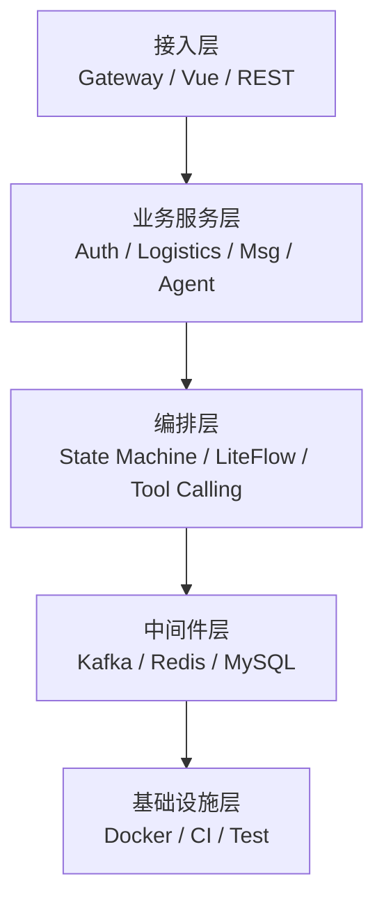
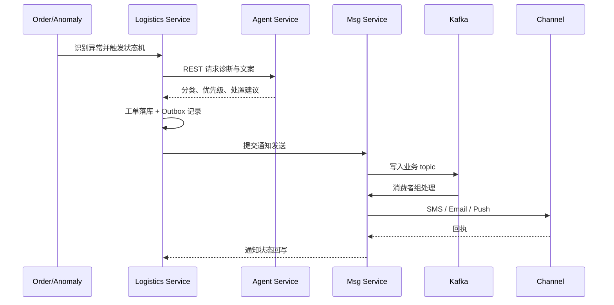
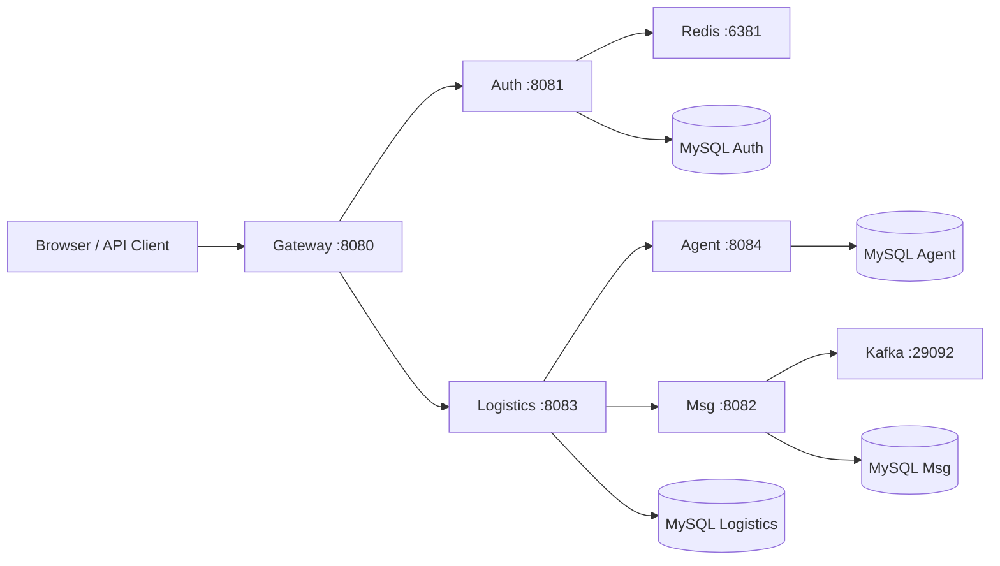

# Sentinel 系统架构

## 1. 架构目标

- 业务域解耦：鉴权、物流、消息和 AI 决策独立演进。
- 高并发稳定：Kafka 削峰、线程池隔离、限流、幂等和降级。
- 数据可追溯：订单、工单、通知、Agent 调用共享 traceId。
- 本地可复现：Docker Compose 一键启动，主链路有自动化验收。

## 2. 分层架构

| 层 | 核心组件 | 说明 |
|---|---|---|
| 接入层 | Spring Cloud Gateway、Vue Admin | 统一路由和登录态校验，避免业务服务重复处理入口逻辑 |
| 业务服务层 | auth、logistics、msg、agent | 按业务域拆分；服务间只走 REST / Kafka |
| 编排层 | 状态机、LiteFlow、Agent 工具白名单 | 将规则判断、模型调用和人工兜底串成责任链 |
| 中间件层 | Kafka、Redis、MySQL | 异步削峰、缓存与去重、事务数据持久化 |
| 基础设施层 | Docker Compose、JUnit、GitHub Actions | 本地部署和持续回归 |

## 3. 主链路数据流

## 4. 关键技术决策

### 异步削峰

- 消息发送进入 Kafka，接口只负责受理和落库，避免下游渠道抖动拖垮主链路。
- 按渠道和消息类型拆分消费者组，慢渠道积压不会阻塞其他渠道。

### 并发隔离

- 每个消费者组配置独立动态线程池，队列容量 128，使用 CallerRunsPolicy 形成背压。
- 业务线程池和模型调用互不抢占资源。

### 数据一致性

- 业务写操作先落 MySQL；Outbox 解决“本地事务成功但消息未发送”的问题。
- Redis ZSet + Lua 实现滑动窗口去重，Lua 保证清理、计数和写入原子执行。

### 故障降级

- 模型异常不进行无限重试，直接回退默认模板或转人工。
- Agent 只装配白名单只读工具，赔付、状态流转等写操作保留人工审批。

## 5. 部署拓扑

微服务版完整部署见 [`../microservices/README.md`](../microservices/README.md)。
