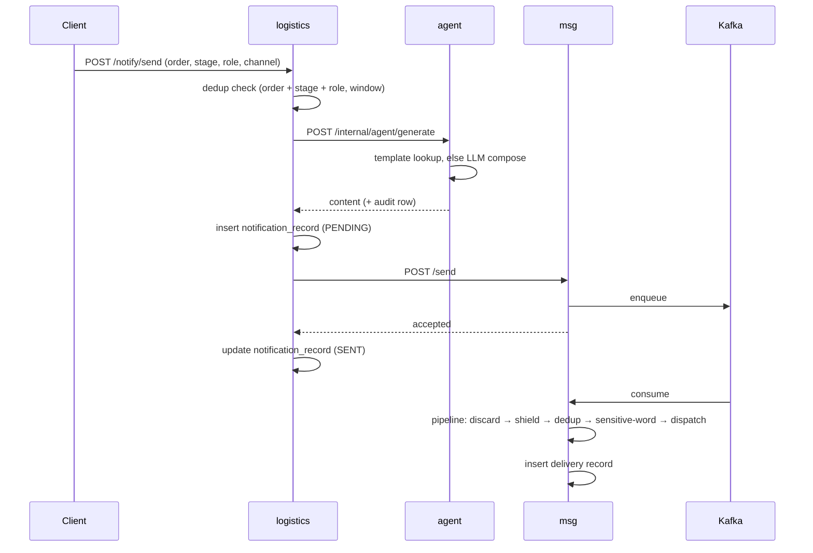
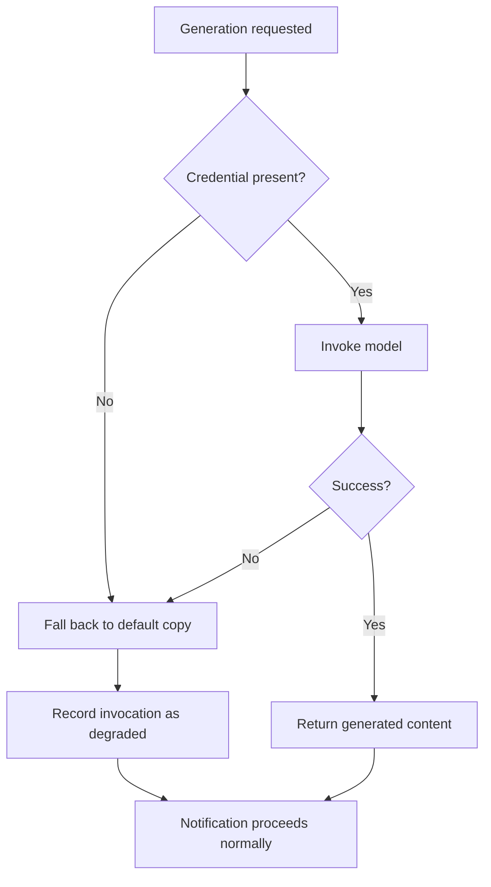
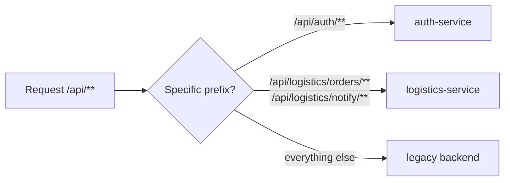

# Architecture

> **Audience:** engineers reviewing or extending the platform.
> For business context see [BUSINESS.md](BUSINESS.md); for measured results see [BENCHMARKS.md](BENCHMARKS.md).
> Decision records — *why* a choice was made at the time — live in [DESIGN.md](../DESIGN.md).

---

## 1. How to Read This Document

Three documents describe this system, and each fact has exactly one home.

| Document | Owns |
|---|---|
| **This document** | Services, data ownership, security mechanism, communication contracts, failure behaviour, deployment topology |
| [BUSINESS.md](BUSINESS.md) | Roles, domain semantics, lifecycle meaning, AI business purpose |
| [BENCHMARKS.md](BENCHMARKS.md) | **Every performance number.** No other document repeats them |
| [DESIGN.md](../DESIGN.md) | Decision records and their rationale |

**Two rules keep these from drifting:**

1. **A number appears once.** Ports, table counts, volumes, and latencies live in exactly one document; every other reference links to it.
2. **A capability carries a status label.** Where a feature exists but is not reachable through the platform's interfaces, it is labelled as such rather than presented as shipped.

> **Language note.** `DESIGN.md` and `docs/BENCHMARKS.md` are intentionally retained in Chinese as the authors' original decision records and measurements. This document and the other product-facing docs are in English.

---

## 2. Architectural Principles

The system is built to three constraints, each with a mechanically enforceable consequence.

| Principle | Mechanism | How it is verified |
|---|---|---|
| **Small code footprint** | Reuse shared modules; never re-implement a concept that already exists as a library module | New services add a startup class, configuration, and domain wiring — not a copy of the authentication layer |
| **High cohesion** | Identity, authentication headers, role checks, and the current-user value object live in exactly one module (`sentinel-ms-web`) | Every service depends on that module rather than carrying its own copy |
| **Low coupling** | Cross-service access only via thin REST clients or Kafka events; **each service owns its database exclusively**; no cross-database joins | A service's `pom.xml` never lists another business service as a dependency |

### 2.1 The anti-pattern this prevents

The failure mode of service decomposition is the **god service** — one process that keeps absorbing domains because splitting is inconvenient. The rule here is explicit: **a new business domain becomes a new small service**, following the playbook in §15, rather than a new package inside an existing one.

---

## 3. System Context

```
                    ┌──────────────────────────────┐
   Browser / API ──▶│  Gateway  :8080              │
   clients          │  · session validation (Redis)│
                    │  · identity header injection │
                    │  · prefix routing            │
                    └───┬──────┬──────────┬────────┘
                        │      │          │
          ┌─────────────┘      │          └──────────────┐
          ▼                    ▼                         ▼
   ┌─────────────┐     ┌──────────────┐          ┌──────────────┐
   │ auth :8081  │     │logistics:8083│          │  (fallback)  │
   │ sessions,   │     │order/notify  │          │ legacy :8090 │
   │ credentials │     │orchestration │          │  /api/**     │
   └──────┬──────┘     └───┬──────┬───┘          └──────────────┘
          │                │      │
          │      ┌─────────┘      └─────────┐
          │      ▼                        ▼
          │  ┌─────────────┐        ┌──────────────┐
          │  │ agent :8084 │◀───────│  msg :8082   │
          │  │ LLM compose │        │message engine│
          │  └─────────────┘        └──────┬───────┘
          │                                │
          │                          ┌─────▼──────┐
          │                          │   Kafka    │
          │                          └─────┬──────┘
          │                                │
   ┌──────▼────────────────────────────────▼──────────────────┐
   │  4 × MySQL (one per service) · Redis (sessions, dedup)   │
   │  SMS stub (channel simulator)                            │
   └──────────────────────────────────────────────────────────┘
```

Two boundaries are drawn explicitly:

- **The trust boundary** is the gateway. Everything behind it assumes the request has already been authenticated — see §6.4 for what that model does and does not guarantee.
- **The migration boundary** is the strangler gateway. Interfaces not yet owned by a microservice are served by the legacy monolith — see §14.

---

## 4. Service Catalog

| Service | Port | Owns database | Responsibility | Explicitly does **not** own |
|---|---|---|---|---|
| **gateway** | 8080 | — | Session validation, identity header injection, prefix routing, CORS | Any business logic |
| **auth-service** | 8081 | `sentinel_auth` | Login, logout, current identity, credentials, SMS verification codes | Authorisation decisions beyond issuing identity |
| **msg-service** | 8082 | `sentinel_msg` | Message composition pipeline, deduplication, channel dispatch, delivery records | Deciding *whether* a message should be sent |
| **logistics-service** | 8083 | `sentinel_logistics` | Orders, tracking, waybills, work orders, notification orchestration, billing data | Generating content or delivering messages |
| **agent-service** | 8084 | `sentinel_agent` | LLM-backed content generation, exception knowledge base, invocation audit | Deciding when generation is needed |

### 4.1 Data ownership at a glance

| Database | Tables | Domain |
|---|---:|---|
| `sentinel_auth` | 3 | Users, roles, role-menu grants |
| `sentinel_msg` | 4 | Message templates, delivery records, channel accounts, opt-outs |
| `sentinel_logistics` | 19 | Orders, tracking, waybills, work orders, notifications, after-sales, merchants, carriers, channels, rates, bills, warehouses, products, inventory, risk rules, audit |
| `sentinel_agent` | 2 | Invocation log, exception knowledge base |

> Table counts are stated here and nowhere else. See §5 for why the split matters more than the counts.

---

## 5. Data Ownership and the No-Cross-Database-Join Rule

### 5.1 The rule

**A service reads only its own database. Cross-domain reads are resolved by one of three sanctioned strategies — never by joining across databases.**

The rule exists because a cross-database join silently couples two services' schemas: it makes independent schema evolution impossible, prevents either database from being moved or rescaled alone, and turns a private implementation detail into a public contract.

### 5.2 The three sanctioned strategies

| Strategy | When to use it | Cost | Example in this system |
|---|---|---|---|
| **Denormalised column** | Read-heavy, low change frequency, weak consistency acceptable | Requires a write path to keep it current | A merchant's owning username is stored alongside the merchant record so order queries never reach the identity database |
| **Synchronous REST** | The answer is needed to complete the current request, and the caller can degrade | Latency and availability coupling; needs a timeout and fallback | Order orchestration calls content generation; a failure degrades to default copy rather than failing the request |
| **Asynchronous event** | The work can complete later; eventual consistency acceptable | Requires idempotency and a delivery guarantee | Notification dispatch is decoupled through the message pipeline |

### 5.3 Choosing between them

```
Need the value to finish the current request?
├─ No  ──────────────────────────────▶ Event
└─ Yes
   ├─ Does it change often, and must it be exact? ─▶ REST (with timeout + degradation)
   └─ Read-mostly and stable? ────────────────────▶ Denormalised column
```

A cross-database join satisfies none of these and is never the answer.

---

## 6. Security and Request Path

### 6.1 Authentication flow

```
Client                Gateway                     Redis              Service
  │                      │                          │                   │
  │ POST /api/auth/login │                          │                   │
  ├─────────────────────▶│──────────────────────────────────────────────▶│
  │                      │                          │        credential │
  │                      │                          │◀───────verified───│
  │                      │◀────────────── token ─────────────────────────│
  │◀───── token ─────────│                          │                   │
  │                      │                          │                   │
  │ GET /api/... (Bearer)│                          │                   │
  ├─────────────────────▶│  lookup token            │                   │
  │                      ├─────────────────────────▶│                   │
  │                      │◀──── username:role ──────┤                   │
  │                      │  inject identity headers │                   │
  │                      ├──────────────────────────────────────────────▶│
```

Sessions are server-side: the token is an opaque identifier, and the authoritative session state lives in Redis. Logout removes the session; there is no client-side token to revoke.

### 6.2 Identity propagation

The gateway injects two headers on the downstream request:

| Header | Content |
|---|---|
| `X-User-Name` | Authenticated username |
| `X-User-Role` | Role code |

The gateway **overwrites** these headers rather than appending, so a client cannot smuggle a forged identity through the gateway on an authenticated request.

Downstream services reconstruct the current user from these headers and expose it to application code through a single shared filter and interceptor pair. Role requirements are declared at the endpoint with an annotation, and evaluation is **default-deny**: an endpoint that requires a role and receives no identity is rejected.

### 6.3 Endpoint roles

| Endpoint group | Required role |
|---|---|
| `/api/auth/login`, `/api/auth/sms/**` | Anonymous (by design — these establish identity) |
| `/api/auth/me`, `/api/auth/logout` | Any authenticated user |
| `/api/logistics/orders/**` | Any authenticated role; results filtered by role (see §6.4) |
| `/api/logistics/notify/**` | ADMIN, OPERATOR |
| Internal service endpoints | Not exposed through the gateway |

### 6.4 Row-level isolation

Merchant scoping is enforced **in the query**, not in the presentation layer:

```
merchant role → restrict orders to those belonging to the requesting merchant
other roles   → unrestricted
```

The membership test resolves through a denormalised owning-username column, per §5.2 — deliberately *not* a join into the identity database.

### 6.5 Trust model — scope and explicit non-guarantees

**This is the honest statement of what the model protects.**

The design assumes a **network trust boundary**: gateway and service ports are reachable only by the gateway and by other trusted callers. Within that boundary, downstream services trust the identity headers they receive.

Therefore this model **does not** provide:

- **Zero-trust service-to-service authentication.** A caller able to reach a business service directly, and able to set headers, is trusted. Protecting against that requires mutual transport authentication or signed identity tokens, neither of which is implemented.
- **Protection against a compromised host** inside the network perimeter.
- **Transport encryption.** Services communicate over plain HTTP; TLS termination is expected at the deployment edge.
- **Fine-grained authorisation beyond role and merchant scope.** There are no per-resource permissions or delegation.

**Deployment implication:** the correct mitigation today is to expose **only the gateway** and keep service ports on an internal network. Deployments that publish business-service ports to untrusted networks do not have the isolation this design assumes.

---

## 7. Inter-Service Communication

### 7.1 Synchronous contracts

| Caller | Callee | Purpose | Timeout | Behaviour on failure |
|---|---|---|---|---|
| logistics | agent | Compose notification content | connect 3 s / read 8 s | Fall back to default copy; record the degradation |
| logistics | msg | Enqueue a message for delivery | connect 3 s / read 8 s | Mark the notification as failed |
| any | auth | Session lookup (via gateway) | Redis, short | Reject the request as unauthenticated |

Clients are thin, configured by URL, and **never carry a dependency on the callee's domain library**. Timeouts are mandatory; a cross-service call without one turns a downstream slowdown into a thread-pool exhaustion event.

### 7.2 Asynchronous: the message pipeline

| Aspect | Detail |
|---|---|
| Broker | Kafka |
| Listener addresses | Internal (container network) and external (host) |
| Producers | msg-service |
| Consumers | msg-service — production and consumption run in the same process |
| Payload | Message identifier, template, parameters, recipients |
| Idempotency | Enforced by the deduplication stage (§9.3) |

Message dispatch is **asynchronous by design**: the HTTP call acknowledges that the request was accepted, and actual channel delivery happens on the consumer side. This decouples the caller's latency from the provider's.

---

## 8. The Notification Closed Loop

The platform's central flow spans three databases.



**Correlation.** A single identifier — composed from order number, stage, language, and recipient role — is written to every row the flow produces, so the agent invocation, the notification record, and the delivery record can be joined *by value* across three databases without any cross-database query.

**Why the notification is marked SENT when the message service accepts it,** rather than when delivery completes: the two are different facts. Acceptance is synchronous and knowable; delivery outcome is asynchronous. Conflating them would make the notification record claim something the platform cannot yet verify — see §11 for how delivery failure surfaces today.

---

## 9. Message Delivery Engine

### 9.1 Pipeline

Delivery is a chain of stages. Each may act on, transform, or terminate the message.

```
Discard ──▶ Shield ──▶ Dedup ──▶ Sensitive word ──▶ Dispatch
   │          │          │            │                │
   │          │          │            │                └─▶ channel provider
   │          │          │            └─▶ mask / block
   │          │          └─▶ drop duplicates within window
   │          └─▶ suppress per time-of-day policy
   └─▶ drop blacklisted recipients
```

A stage terminates the chain by setting a break flag on the pipeline context; the controller stops iterating. **This makes each stage's termination condition load-bearing** — a stage that breaks when it should not silently drops messages with no send attempt.

### 9.2 Time-of-day policy

Templates carry a suppression policy: never suppress, suppress during quiet hours, or defer to the next morning. Suppression applies only during configured quiet hours.

> **Implementation note.** The policy value is an enumerated setting. A row carrying a value outside the enumeration is neither "never suppress" nor a recognised suppression mode — historically this caused messages to be dropped during quiet hours with no log entry. The data has been corrected and the stage now breaks only when it has actually suppressed a message; the default was also corrected so newly created templates inherit a valid value.

### 9.3 Deduplication

Duplicate suppression uses a sorted set with an atomic script, so the check-and-record is a single operation:

| Situation | Outcome |
|---|---|
| First write in a window | Admitted |
| Second write in the same window | Suppressed |
| New key, first write | Admitted |
| After window expiry | Admitted |

> **Fail-open is deliberate.** If the deduplication store is unavailable, the engine **admits** the message rather than dropping it. For a notification platform, a duplicate message is a smaller failure than a missing one.

### 9.4 Templates and channels

| Concept | Purpose |
|---|---|
| Template | Pre-approved content per stage and language, with placeholders |
| Channel account | The provider credential and endpoint for a delivery channel |
| Delivery record | Per-recipient outcome, provider response, and billing count |

---

## 10. AI Agent Layer

### 10.1 Framework and model

| Aspect | Detail |
|---|---|
| Framework | LangChain4j |
| Provider | DashScope (Qwen) |
| Credential | Injected via environment; **never committed** |
| Available capabilities | Six, described below |

### 10.2 Capability status

| Capability | Purpose | Status | Reachable via HTTP | Degradation tested |
|---|---|---|:---:|:---:|
| **Notification copywriting** | Compose message content | **Shipped** | ✅ | ✅ |
| Exception diagnosis | Explain a stall and recommend action | Implemented, not yet exposed | — | ✅ |
| Work-order triage | Classify and prioritise | Implemented, not yet exposed | — | ✅ |
| Support intent routing | Decide auto-reply vs. human | Implemented, not yet exposed | — | ✅ |
| Channel recommendation | Rank routes by cost and speed | Implemented, not yet exposed | — | ✅ |
| Delivery-time estimation | Estimate remaining days | Implemented, not yet exposed | — | ✅ |

> **Status vocabulary is shared across all four documents** — defined in [README §Project Status](../README.md). Here, *Implemented, not yet exposed* means the capability is present in the codebase and unit-tested for degradation, but has no service endpoint. It is a real asset of the codebase and a non-shipped interface; both facts are stated so neither is overstated.

### 10.3 Retrieval grounding

Diagnosis draws on a curated knowledge base of exception conditions: carrier status code → exception type, description, typical resolution duration, and recommended handling. Grounding recommendations in a curated corpus — rather than relying on model recall — keeps advice consistent between operators and traceable to a documented rule.

### 10.4 Graceful degradation



**Degradation is a first-class path, not an error handler.** The caller receives usable content in every branch, and the fallback is recorded so degradation rate is measurable. A notification platform that stops notifying when a third-party model is unreachable has failed at its primary job.

### 10.5 Invocation audit

Each invocation records: capability name, structured input, structured output, tools invoked, token consumption, latency, outcome (`success` / `degraded` / `failed` / `timeout`), and the correlation identifier. This makes cost attributable and generated copy reviewable.

---

## 11. Reliability and Failure Modes

| Failing component | Detection | System behaviour | User-visible effect | Recovery |
|---|---|---|---|---|
| **AI provider credential absent** | At invocation | Fall back to default copy, record `degraded` | Notifications delivered with generic copy | Automatic once credential configured |
| **AI provider slow or unreachable** | Read timeout on the caller | Caller falls back; the in-flight invocation is abandoned | Notification delayed by the timeout, then delivered | Automatic |
| **Message service unreachable** | REST failure | Notification record marked failed | Notifications for that window are lost to the caller | Not automatic — see §11.1 |
| **Deduplication store unavailable** | Script failure | Fail-open: messages are admitted | Possible duplicate messages | Automatic |
| **Kafka unavailable** | Producer/consumer errors | Message dispatch cannot proceed | Notifications recorded as accepted but not delivered | Automatic on broker recovery for queued messages |
| **A service's database unavailable** | Connection errors | That service fails; others unaffected (independent databases) | Feature-specific errors | Automatic |
| **Ordering**: service starts before dependencies | Health checks in the compose topology | Startup ordering enforced by declared dependencies | None | Automatic |

### 11.1 Known gap: no compensation for failed dispatch

If the message service is unreachable when a notification is dispatched, the notification is marked failed and **there is no automatic retry or compensating job**. The platform does not currently sweep failed notifications and re-dispatch them.

This is the most significant operational limitation in the closed loop. The correct remedy is a scheduled reconciliation that re-attempts failed notifications within the deduplication window; it is not implemented. See §17.

---

## 12. Observability

### 12.1 What exists

| Capability | Detail |
|---|---|
| Structured logging | Per-service logs with a consistent line format |
| Correlation | The composite identifier in §8 threads one logical operation across three databases |
| AI invocation audit | Every model call persisted with input, output, latency, tokens, and outcome |
| Health checks | Container-level liveness for stateful dependencies; startup ordering depends on them |
| End-to-end verification | A smoke script asserts the full loop and its database rows |

### 12.2 What does not exist

Stated plainly, because a reviewer should not have to discover these:

- **No distributed tracing.** No trace or span propagation between services. Correlation is by application-level identifier, not by tracing instrumentation.
- **No metrics export.** No Prometheus endpoint, no dashboards, no alerting. Failure detection is currently log-based and manual.
- **No centralised log aggregation.** Logs are per-container.
- **No alerting on degradation or failure.** Degradation is recorded but nothing notifies an operator that it happened.

These are the natural next investments; see §17.

---

## 13. Deployment Topology

### 13.1 Container stack

The stack runs as a single Compose project comprising the gateway, four business services, a frontend, four dedicated MySQL instances, Redis, Kafka with its coordination service, and an SMS channel simulator.

> The exact container count is intentionally not restated here; it is derivable from `infra/docker/compose.infra.yml`, which is the single source of truth.

### 13.2 Port map

| Component | Host port | Purpose |
|---|---:|---|
| Gateway | 8080 | **The only application entry point** |
| auth-service | 8081 | Debug / direct access within a trusted network |
| msg-service | 8082 | Debug / direct access within a trusted network |
| logistics-service | 8083 | Debug / direct access within a trusted network |
| agent-service | 8084 | Debug / direct access within a trusted network |
| Frontend (demo surface) | 5175 | Minimal slice-only UI |
| Frontend (full UI) | 5173 | Full UI, requires the legacy backend |
| MySQL × 4 | 33061–33064 | Per-service databases, exposed for inspection |
| Redis | 6381 | Sessions, deduplication |
| Kafka | 29092 | External listener |
| Coordination service | 2181 | Kafka dependency |
| SMS simulator | 18999 | Stands in for a channel provider |

> **Security implication.** Per §6.5, business-service and database ports are published for local development and inspection. In any deployment reachable by untrusted clients, **only 8080 should be exposed**.

### 13.3 Data lifecycle

Each database is backed by its own named volume. Tearing the stack down preserves volumes; removing them is an explicit, separate action. Initialisation scripts run **only when the volume is first created** — a schema change to an init script does not migrate an existing volume, and must be applied to the running database separately.

### 13.4 Configuration

Services read configuration from environment variables with working local defaults, so the same artifact runs both inside containers and as a host process.

| Variable class | Examples | Purpose |
|---|---|---|
| Datasource | URL, username, password | Per-service database |
| Redis | host, port, password | Shared session and deduplication store |
| Kafka | bootstrap servers | Broker address, differs inside vs. outside the container network |
| Service URLs | agent URL, msg URL | Cross-service direct calls |
| Provider credential | LLM API key | AI capability; absent means deliberate degradation |
| Business tuning | Deduplication window, dispatch enabled, template selection | Operational behaviour without a rebuild |

> **Operations note.** Several behavioural settings (deduplication rules, flow-control thresholds) are packaged into the service artifact rather than resolved from external configuration. Changing them currently requires a rebuild. Externalising this configuration is a prerequisite for the service-registry work in §16.

### 13.5 Continuous integration

| Stage | Action | Failure means |
|---|---|---|
| Build | Compile and package all modules | Code does not compile |
| Image | Build service images | Dockerfile or artifact path broken |
| Stack | Start the full stack | Dependency, port, or configuration problem |
| Verify | Run the closed-loop smoke test | The end-to-end contract is broken |
| Teardown | Stop the stack | — |

The pipeline's value is the fourth stage: it asserts the **end-to-end business contract**, not just that the code compiles.

---

## 14. Frontend and the Strangler Gateway

The full UI depends on a large surface of interfaces. Rather than porting all of them before the UI can run, the gateway is a **strangler**:



- **Migrated prefixes** route to their owning microservice.
- **Everything else** falls back to the legacy backend, so every UI page has data while migration proceeds.
- Both sides share the session store, so a token issued at login works against either backend without modification.

**Migrating a domain is two steps:** implement the interfaces in the owning microservice at the same paths, then repoint that prefix in the gateway. The UI is untouched and the migration is invisible to it.

---

## 15. Extension Playbook

To bring a new domain or a new service online:

1. **Create the service shell.** Reference the relevant domain library module; add only the dependencies actually needed (web, JDBC, the shared web layer, a driver).
2. **Place the startup class in its own package** and declare component, entity, and repository scan targets explicitly. Exclude the shared modules' unrelated wiring using regex-based exclusions — never class references, which trigger eager loading.
3. **Cross-process capability = a thin client.** A component with a configured URL and an explicit degradation path. Never a dependency on the callee's library.
4. **Own configuration.** Sensible local defaults, overridable by environment for containerised runs.
5. **Append an assertion to the smoke script** covering the new path, so the CI pipeline protects it.

> This playbook is restated from `DESIGN.md §3`; that document remains the authority on the rationale.

---

## 16. Technology Constraints and Upgrade Path

| Component | Pinned at | Why pinned | To upgrade |
|---|---|---|---|
| Spring Boot | 2.7.x | `javax.*` namespace | Migrate to the `jakarta.*` namespace and Spring Boot 3.x; touches every service and the shared modules |
| Spring Cloud | 2021.0.x | Compatible release train for the above | Move with Spring Boot; gateway configuration format changes |
| Build/runtime JDK | 17 baseline, runs on 21 | Baseline chosen for library compatibility | Raising the baseline is low risk; the `javax` constraint is the real blocker |
| MySQL | 5.7 | Baseline of the original schema export | Schema is largely portable; validate driver and dialect behaviour |
| Kafka | 2.6 | Baseline of the original pipeline | Client and broker are broadly compatible across minor versions |

> This is a **reference implementation**, not a declaration of production readiness. The baseline predates the `jakarta` namespace and several components are past upstream support. The upgrade path above is the honest statement of what adopting it in production would require.

### 16.1 Externalised configuration

Related to the table above: business tuning values currently packaged into artifacts must move to external configuration before a service registry or dynamic configuration source can be introduced — otherwise configuration changes still require redeployment.

---

## 17. Known Limitations and Non-Goals

Stated explicitly so the platform's maturity is not misjudged.

**Limitations**

| # | Limitation | Reference |
|---|---|---|
| 1 | Failed notification dispatch has no automatic retry or compensation | §11.1 |
| 2 | No distributed tracing, metrics, alerting, or log aggregation | §12.2 |
| 3 | Identity trust assumes a network boundary; no service-to-service authentication | §6.5 |
| 4 | Several AI capabilities are library-only, not reachable through endpoints | §10.2 |
| 5 | Business tuning values require a rebuild to change | §13.4 |
| 6 | Delivery outcome is not fed back to the notification record | §8 |

**Non-goals**

- **Multi-region or multi-tenant deployment.** The data model is single-tenant.
- **Event sourcing.** State is materialised, not event-derived.
- **Real-time streaming analytics.** Reporting is periodic and query-based.
- **Autonomous financial decisions.** Liability and compensation remain human decisions by design — see [BUSINESS.md §8.3](BUSINESS.md).

---

## 18. Decision Index

| Decision | Authority |
|---|---|
| Service decomposition and its constraints | [DESIGN.md](../DESIGN.md) §1–2 |
| Extension conventions | [DESIGN.md](../DESIGN.md) §3 |
| Behavioural equivalence with the original monolith | [DESIGN.md](../DESIGN.md) §4 |
| Strangler gateway strategy | [DESIGN.md](../DESIGN.md) §7 |
| Migration sequencing | [DESIGN.md](../DESIGN.md) §6 |
| Measured performance | [BENCHMARKS.md](BENCHMARKS.md) |

---

**See also:** [BUSINESS.md](BUSINESS.md) · [BENCHMARKS.md](BENCHMARKS.md) · [DESIGN.md](../DESIGN.md) · [README.md](../README.md)
