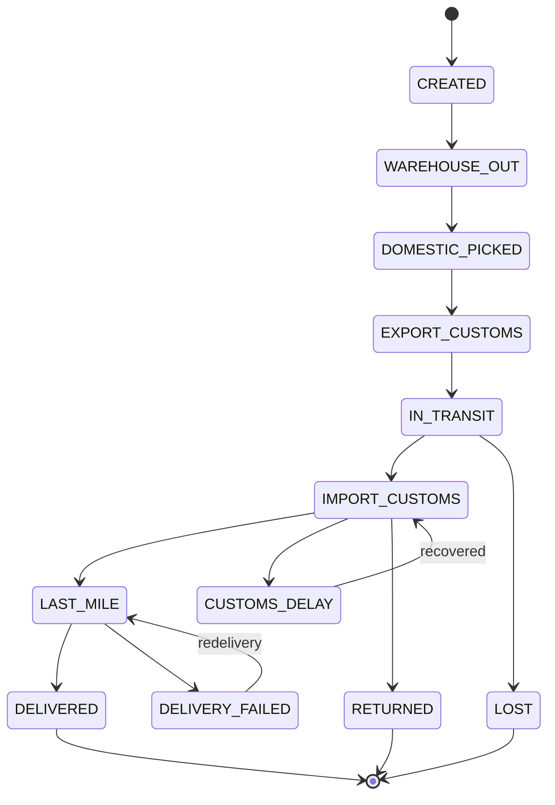
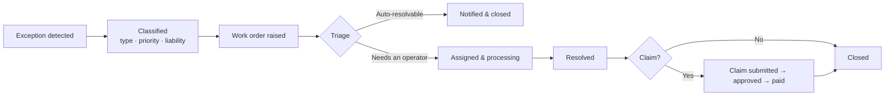

# Business Overview

> **Audience:** product managers, operations leads, business stakeholders, and cross-functional partners.
> This document describes **what Sentinel does and why** — not how it is built.
> For system design see [ARCHITECTURE.md](ARCHITECTURE.md); for measured results see [BENCHMARKS.md](BENCHMARKS.md).

---

## 1. The Problem

A parcel moving through a domestic logistics network passes through many hands: the merchant's warehouse, a pickup carrier, one or more regional hubs, line-haul transport, a destination hub, and finally a last-mile courier. Each handoff is a place where a parcel can stall — a hub backlog, a missed dispatch, a failed delivery attempt, a parcel that simply goes missing.

The operational reality of most networks is that **nobody finds out until the customer complains**:

| Consequence | Why it happens |
|---|---|
| Support cost inflates | The customer asks first, so every exception becomes an inbound ticket |
| Compensation is paid late and inconsistently | Classification and liability are decided case by case, by hand |
| Merchants lose trust | They learn about problems from their own buyers, not from the platform |
| Reconciliation drifts | Undelivered and returned parcels are disputed months later in billing |

The root cause is not a lack of data — every network already records tracking scans. It is that **scans are recorded but not interpreted**. A parcel sitting at a destination hub for three days produces a row in a tracking table and nothing else.

Sentinel closes that gap by turning tracking data into **timely, classified, acted-upon exceptions**.

---

## 2. What Sentinel Does

Three capabilities, in sequence:

### 2.1 Detect — notice the exception before the customer does

Continuously watch in-flight parcels against two independent criteria:

- **Dwell time** — a parcel has remained at a hub or stage longer than the expected threshold.
- **SLA position** — the promised delivery window is approaching (risk) or has passed (breach).

Detection is what converts a passive tracking table into an operational queue.

### 2.2 Decide & Act — classify, prioritise, and route

Once an exception is recognised, Sentinel determines *what kind* of problem it is, *how severe*, and *who should act*:

- **Classification** — the exception type (delay, failed delivery, loss, return, SLA breach).
- **Priority** — P0 / P1 / P2, driving response expectations.
- **Liability** — merchant, carrier, or platform, which determines who bears the cost.
- **Routing** — raise a work order for an operator, notify the customer, or both.

### 2.3 Notify — reach the right party, in their language, automatically

Every meaningful state change produces a notification to the party who cares about it:

- **Buyers** get progress and apology messaging.
- **Merchants** get exception alerts on their own shipments.
- **Customer service** gets internal escalation signals.

Notifications are composed per recipient and language, and — critically — **delivery is guaranteed even when the AI layer is unavailable** (see §9.4).

---

## 3. Actors & Roles

Sentinel defines five roles. Each has a distinct job and a distinct data scope.

| Role | Business identity | Owns | Data scope | Typical actions |
|---|---|---|---|---|
| **ADMIN** | Platform administrator | Platform configuration and governance | Everything | User and role management, master data, all records |
| **OPERATOR** | Fulfilment operations | Day-to-day order movement | All orders and shipments | Dispatch, waybill generation, exception handling in bulk |
| **CUSTOMER_SERVICE** | Support agent | Customer-facing problem resolution | Work orders, tracking, after-sales | Triage exceptions, contact buyers, raise and close work orders |
| **MERCHANT** | Seller on the platform | Their own shipments | **Only their own orders** (enforced at row level) | Place and track orders, manage own products |
| **FINANCE** | Finance and billing | Money movement | Bills, rates, reconciliation | Verify carrier invoices, reconcile charges, manage rate cards |

> **Data isolation is a business promise, not a preference.** A merchant can never see another merchant's orders — this is enforced in the data layer, not merely hidden in the UI. See [ARCHITECTURE.md](ARCHITECTURE.md) for the mechanism.

---

## 4. Domain Map

The business domain splits into seven areas.

| Area | Entities | The business question it answers |
|---|---|---|
| **Orders & transport** | Order, tracking event, waybill | Where is this shipment, and what is it costing? |
| **Exceptions & resolution** | Exception work order, risk rule | What went wrong, how bad is it, who fixes it, who pays? |
| **Engagement** | Notification record, message template | Who needs to know, and did they get told? |
| **After-sales** | Return / exchange request | What happens when the customer does not want the parcel? |
| **Master data** | Merchant, carrier, channel, rate card, warehouse, product SKU, inventory ledger | What is being shipped, by whom, through which route, at what price? |
| **Finance** | Carrier bill, bill line item | What do we owe the carrier, and does it match what we expected? |
| **Platform** | API key, operation audit log | Who accessed what, and under whose authority? |

### 4.1 Entity relationships

```
Order ─┬─ Tracking events        (1:N, the scan history)
       ├─ Waybill                (1:N, one order may split across shipments)
       │    └─ Bill line item → Carrier bill   (1:1 posting into the billing period)
       ├─ Exception work order   (1:N)
       ├─ After-sales request    (1:1)
       └─ Notification records   (1:N, one per recipient per event)
```

---

## 5. Order & Parcel Lifecycle

### 5.1 The normal path

| # | Stage | What it means | Who acts next | What the customer sees |
|---|---|---|---|---|
| 1 | `CREATED` | Order placed and accepted | Warehouse | "Order confirmed" |
| 2 | `WAREHOUSE_OUT` | Parcel packed and dispatched from the warehouse | Pickup carrier | "Preparing for pickup" |
| 3 | `DOMESTIC_PICKED` | Picked up and in the carrier's network | Origin hub | "Picked up" |
| 4 | `EXPORT_CUSTOMS` | Sorted at the origin hub and handed to line-haul | Line-haul | "In transit" |
| 5 | `IN_TRANSIT` | Moving between regions | Destination hub | "In transit" |
| 6 | `IMPORT_CUSTOMS` | Arrived and sorted at the destination hub | Last-mile courier | "Arrived in your region" |
| 7 | `LAST_MILE` | Out for delivery | Courier | "Out for delivery" |
| 8 | `DELIVERED` | Delivered and signed for — **terminal state** | — | "Delivered" |

> **Naming note.** Stage identifiers 4 and 6 read as `EXPORT_CUSTOMS` / `IMPORT_CUSTOMS` because the platform's data model descends from a cross-border system. Sentinel's live network is **domestic**: these two stages mean *origin hub sortation* and *destination hub sortation*. Stage 4 maps to the business label 中转分拨 and stage 6 to 到达分拨. The identifiers are retained for data continuity; the business meaning above is authoritative.

### 5.2 Exception branches



Two exception stages are **recoverable** — a delayed hub movement can resume, and a failed delivery can be reattempted. Three states are **terminal**: delivered, lost, returned.

### 5.3 Why transitions are constrained

The platform validates every stage change against a permitted-transition table. A parcel cannot move backwards — a delivered parcel cannot return to line-haul, and an in-transit parcel cannot skip the destination hub.

This matters commercially:

- **Billing integrity.** Freight is priced on the route actually taken. Unconstrained stage changes would silently corrupt distance and zone calculations.
- **SLA accountability.** Breach attribution depends on knowing when each stage genuinely completed. A rewritable history makes carrier performance unmeasurable.
- **Dispute resolution.** When a merchant disputes a charge, the transition history is the evidence.

---

## 6. Exception Management

### 6.1 Classification

Every exception carries four attributes.

| Attribute | Values | Business meaning |
|---|---|---|
| **Type** | Transit delay, failed delivery, loss, return, SLA breach | What went wrong |
| **Priority** | **P0** / **P1** / **P2** | Response urgency. Loss is typically P0; delays are P1/P2 |
| **Liability** | Merchant / Carrier / Platform | **Who bears the cost** |
| **Claim status** | None → Submitted → Approved → Paid → Rejected | Where the money dispute stands |

The liability field is the commercially significant one. A lost parcel is normally a carrier matter; a delay caused by late dispatch is a merchant matter. Recording this at classification time — rather than arguing about it later — is what makes compensation consistent.

### 6.2 Work order lifecycle



Work orders carry a diagnosis and a standard operating procedure where the AI layer has produced one, so the operator starts from a recommendation rather than a blank page.

### 6.3 SLA tracking

Each order carries an SLA position:

| Status | Meaning | Operational trigger |
|---|---|---|
| `NORMAL` | On track | none |
| `RISK` | Promise window approaching | Preventive notification |
| `BREACHED` | Promise window missed | Work order raised, carrier performance recorded |
| `NA` | Not assessed | — |

SLA position is derived from the carrier channel's committed transit window (`transit_days_min` / `transit_days_max`) compared against actual progress — so carrier promises are the yardstick, not a platform-wide constant.

### 6.4 Risk rules

Rule configuration maps a detected condition to an automated action:

| Scene | Trigger | Action |
|---|---|---|
| SLA | `RISK` | Notify (e.g. email to the owning merchant) |
| SLA | `BREACHED` | Raise a high-priority work order |
| Anomaly | Stuck beyond threshold | Raise a work order |

This is the configuration surface that lets operations tune the platform's automatic behaviour without engineering involvement.

### 6.5 Who gets notified, and when

| Stage / event | Buyer | Merchant | Customer service |
|---|---|---|---|
| `WAREHOUSE_OUT` | ✓ | | |
| `DOMESTIC_PICKED` | ✓ | | |
| `EXPORT_CUSTOMS` | ✓ | | |
| `IN_TRANSIT` | ✓ | | |
| `IMPORT_CUSTOMS` | ✓ | | |
| `LAST_MILE` | ✓ | | |
| `DELIVERED` | ✓ | ✓ | |
| `CUSTOMS_DELAY` (transit delay) | ✓ | ✓ | ✓ |
| `DELIVERY_FAILED` | ✓ | ✓ | ✓ |
| `LOST` | ✓ | ✓ | ✓ |
| `RETURNED` | ✓ | ✓ | ✓ |
| SLA `RISK` | | ✓ | |
| SLA `BREACHED` | | ✓ | ✓ |

Exception events fan out to more parties than routine progress events — the point being that a problem is communicated proactively rather than discovered.

---

## 7. Notification & Engagement

### 7.1 How a notification is composed

Content is generated per recipient, not broadcast:

- **Recipient role** — a buyer receives reassurance; a merchant receives an operational alert; customer service receives an escalation.
- **Triggering stage** — the message reflects the actual state change.
- **Language** — content is resolved per recipient language, so one order event produces correctly localised messages for each party.
- **Channel** — short message service, push, email, or enterprise chat, selected per notification.

### 7.2 Template-first, AI-fallback

Notification content resolves in two tiers:

1. **Curated template.** A pre-approved message for that stage and language. Used whenever one exists — predictable, reviewed, and effectively free.
2. **AI-generated fallback.** Where no suitable template exists, content is composed by the language model from the order context.

This ordering is a deliberate commercial choice: approval workflows and per-message cost both favour templates, and AI is reserved for the long tail.

### 7.3 Degradation is a business guarantee

**When the AI layer is unavailable, notifications are still delivered.** The platform falls back to curated default copy, records the degradation for audit, and completes the notification.

This is a product promise rather than an implementation detail. Notification is a customer-facing commitment; it must not depend on the availability of a third-party model provider. See [BENCHMARKS.md](BENCHMARKS.md) for the measured behaviour under AI service outage.

---

## 8. AI in the Loop

### 8.1 Where AI is used

| Capability | Business question it answers | Output | Status |
|---|---|---|---|
| **Notification copywriting** | What should this message say, for this recipient and language? | Message text | **Shipped** |
| **Exception diagnosis** | Why did this parcel stall, and what should we do? | Reason, suggested action, priority | **Implemented, not yet exposed** |
| **Work order triage** | How should this be classified and who handles it? | Type, priority, standard procedure | **Implemented, not yet exposed** |
| **Support intent routing** | Can this enquiry be answered automatically, or does it need a human? | Intent, routing decision, draft reply | **Implemented, not yet exposed** |
| **Channel recommendation** | Which carrier route is cheapest and fastest for this parcel? | Ranked channel options | **Implemented, not yet exposed** |
| **Delivery time estimation** | When will this actually arrive? | Estimated remaining days | **Implemented, not yet exposed** |

> **Status labels are used consistently across all four documents** — see [README §Project Status](../README.md) for the definition of each. *Shipped* means reachable through the platform's interfaces; *Implemented, not yet exposed* means the capability exists in the codebase but has no endpoint yet. Both are real; conflating them would misrepresent readiness.

### 8.2 Exception knowledge base

Diagnosis is grounded in a curated knowledge base of exception conditions — 24 entries mapping carrier-reported status codes to an exception type, a plain-language description, typical resolution duration, and recommended handling.

Using a knowledge base rather than free-form model reasoning matters for two reasons: recommendations stay consistent between operators, and the advice is traceable to a documented rule rather than a model's assertion.

### 8.3 Human-in-the-loop boundaries

**The AI recommends; it does not decide.** Specifically, it does **not**:

- approve or deny compensation claims,
- assign liability between merchant, carrier, and platform,
- change prices, rates, or freight charges,
- close work orders.

These remain human decisions. The AI's role is to shorten the time from *detection* to *an informed decision*, not to remove judgement from commercially sensitive outcomes.

### 8.4 Auditability

Every model invocation is recorded: which capability ran, its input and output, latency, token consumption, and whether it succeeded, degraded, or failed. This supports three business needs — cost attribution, quality review of generated copy, and the ability to explain to a customer or merchant why a message said what it said.

---

## 9. After-Sales & Returns

When a delivery fails or a customer declines a parcel, an after-sales request captures the resolution:

| Attribute | Values |
|---|---|
| **Resolution type** | Return or exchange |
| **Reason** | Recorded per request |
| **Refund amount** | Where a refund applies |
| **Status** | Pending → Refunding → Refunded, or Reshipped → Closed |

Returns are linked to the originating order and to any open exception work order, so a return is never handled as an isolated event — the exception that caused it remains visible alongside.

---

## 10. Finance & Reconciliation

Freight is priced from **rate cards**, not negotiated per shipment.

| Concept | Definition |
|---|---|
| **Channel** | A specific carrier service on a specific lane (e.g. a rail line between two regions) |
| **Rate card** | Price for a channel by geography and weight band |
| **Pricing modes** | Per-kilogram, or first-weight-plus-continued-weight |
| **Volumetric weight** | Charged weight is the greater of actual and volumetric, using the channel's divisor |
| **Minimum billable weight** | A floor below which the full minimum is charged regardless |

Reconciliation compares what the system calculated at dispatch against what the carrier invoiced:

1. Carrier submits a bill for a period.
2. Each line item is matched to the originating waybill and its recorded charged weight.
3. Discrepancies are reviewed and either verified or rejected.
4. Verified bills settle; rejected lines return to the carrier for correction.

| Bill status | Meaning |
|---|---|
| `DRAFT` | Being assembled |
| `SUBMITTED` | Received from carrier, awaiting review |
| `VERIFIED` | Accepted by finance |
| `SETTLED` | Paid |
| `REJECTED` | Disputed, returned to carrier |

Because charged weight is captured at dispatch and carried through to the bill line item, reconciliation compares like with like rather than re-deriving weights after the fact.

---

## 11. Merchant & Partner Ecosystem

### 11.1 The merchant promise

Each merchant sees exactly one thing: **their own** orders, shipments, products, and exceptions. This is enforced in the data layer, so it holds regardless of how the data is requested — through the UI, through the API, or through a report.

Merchants also maintain their own catalogue: product SKUs with declared values, weights, and dimensions, and their own inventory position per warehouse.

### 11.2 Carrier and channel management

Platform operators curate the network:

- **Carriers** — the companies moving parcels, with contact details and integration endpoints.
- **Channels** — the specific services offered, each with a committed transit window that becomes the SLA yardstick.
- **Rate cards** — the commercial terms governing each channel.

Onboarding a new carrier service is a configuration activity, not a code change.

---

## 12. End-to-End Workflows

### W1 — A normal shipment

> A merchant's order is accepted and dispatched from the warehouse. The pickup carrier collects it, it is sorted at the origin hub, moves by line-haul, is sorted again at the destination hub, goes out for delivery, and is signed for.
>
> The buyer receives a notification at each stage. The merchant sees the shipment progress in their own view. Charged weight is captured at dispatch and will appear on the next carrier bill. No human intervenes at any point.

### W2 — A hub delay, caught before the customer notices

> A parcel arrives at the destination hub and does not move. Dwell time crosses the configured threshold.
>
> The platform classifies a transit delay, marks the order's SLA position, and raises a work order. A notification is composed for the buyer explaining the delay, and the owning merchant is alerted. Customer service sees the case in their queue with a suggested handling procedure attached.
>
> The parcel eventually moves on; the delay is recorded against the carrier's performance. **The customer learned about the delay from Sentinel, not by asking.**

### W3 — A P0 loss

> Line-haul scans stop. The parcel is classified as lost — a terminal state.
>
> Because loss is a P0 event, a high-priority work order is raised immediately with liability attributed to the carrier. The buyer is notified, the merchant is notified, and customer service receives an escalation.
>
> A compensation claim is submitted, reviewed by a human, approved or rejected, and paid. The claim's progress is tracked independently of the work order so that resolution of the operational problem and settlement of the financial one do not block each other.

### W4 — Period-end reconciliation

> Finance opens a carrier bill covering all waybills shipped in the period.
>
> Each line is matched against the charged weight recorded at dispatch. Lines agree; those that do not are flagged. Finance verifies the clean lines, rejects the disputed ones back to the carrier, and settles the balance.

---

## 13. Capability Matrix

| Capability | ADMIN | OPERATOR | CUSTOMER_SERVICE | MERCHANT | FINANCE |
|---|:---:|:---:|:---:|:---:|:---:|
| Order creation and tracking | ✓ | ✓ | ✓ | ✓ (own) | |
| All-orders visibility | ✓ | ✓ | ✓ | | |
| Exception work orders | ✓ | ✓ | ✓ | own only | |
| SLA and risk monitoring | ✓ | ✓ | ✓ | own only | |
| Notification management | ✓ | ✓ | ✓ | own only | |
| After-sales and returns | ✓ | ✓ | ✓ | own only | |
| Carrier and channel master data | ✓ | ✓ | | | ✓ |
| Rate cards | ✓ | | | | ✓ |
| Bills and reconciliation | ✓ | | | | ✓ |
| Product catalogue | ✓ | ✓ | | ✓ (own) | |
| Inventory | ✓ | ✓ | | ✓ (own) | |
| User and role management | ✓ | | | | |
| Audit log | ✓ | | | | |
| API credentials | ✓ | | | | |

---

## 14. Glossary

| English | Chinese | Definition |
|---|---|---|
| Order | 订单 | A merchant's shipment request and its lifecycle |
| Tracking event | 轨迹 | A single scan or status report from a carrier |
| Waybill | 运单 | A physical shipment; one order may produce several |
| Exception | 异常 | A deviation from the expected path or timing |
| Work order | 工单 | The unit of exception handling and its resolution record |
| Transit delay | 中转延误 | A stall at an intermediate hub |
| Failed delivery | 派送失败 | An unsuccessful delivery attempt |
| Loss | 丢件 | A parcel that will not be delivered — terminal |
| Return | 退回 | A parcel sent back to origin — terminal |
| SLA breach | 时效违约 | The promised delivery window was missed |
| Channel | 渠道 | A specific carrier service on a specific lane |
| Rate card | 价卡 | The pricing terms for a channel |
| Charged weight | 计费重 | The greater of actual and volumetric weight |
| Merchant | 商家 | A seller on the platform |
| Carrier | 承运商 | A company that physically moves parcels |
| After-sales | 售后 | Returns, exchanges, and refunds |
| Reconciliation | 对账 | Matching carrier invoices against recorded charges |

> **Terminology is fixed.** "Work order" is used throughout — not "ticket" or "case". Where a Chinese UI label appears in this document it is given in parentheses for cross-reference.

---

## 15. Metrics & KPIs

| Metric | Definition | Why it matters | Measurable today? |
|---|---|---|---|
| Exception detection lead time | Time from exception occurring to it being raised | The core value of proactive detection | Yes — exception events are timestamped |
| Notification delivery rate | Notifications successfully delivered ÷ attempted | The customer-facing commitment | Yes — delivery records are persisted |
| AI degradation rate | Model invocations that fell back ÷ total | Service quality and cost exposure | Yes — every invocation is logged |
| SLA breach rate | Breached orders ÷ delivered orders, by carrier | Carrier performance management | Yes |
| Time to resolution | Work order raised → closed | Operational efficiency | Yes |
| Claim cycle time | Claim submitted → paid | Merchant and buyer satisfaction | Yes |
| Reconciliation discrepancy rate | Disputed bill lines ÷ total lines | Billing accuracy and carrier quality | Yes |
| First-contact resolution | Enquiries resolved without human handling | Support cost | **Design goal** — depends on intent routing being enabled |

> The final column separates metrics the platform records today from outcomes it is designed to improve but does not yet instrument. Figures are deliberately omitted here; measured results belong in [BENCHMARKS.md](BENCHMARKS.md).

---

## 16. Roadmap

| Horizon | Intent |
|---|---|
| **Now** | Exception detection, classification, notification closed loop, merchant data isolation, carrier billing |
| **Next** | Automated exception diagnosis and work order triage surfaced to operators; support intent routing; channel recommendation at order time |
| **Later** | Predictive delivery estimation, proactive capacity and route optimisation, deeper carrier performance analytics |

---

**See also:** [ARCHITECTURE.md](ARCHITECTURE.md) · [BENCHMARKS.md](BENCHMARKS.md) · [DESIGN.md](../DESIGN.md)
